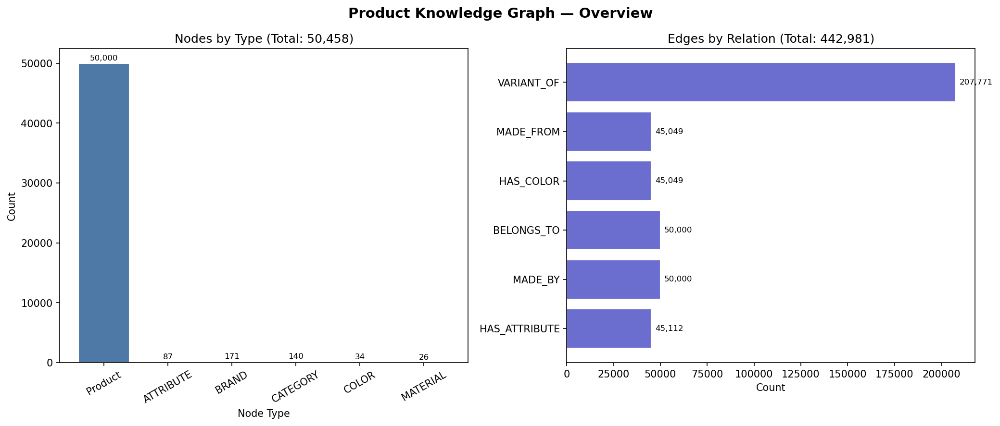

# E-Commerce Product Knowledge Graph

## Overview

This project builds a complete, end-to-end product knowledge graph pipeline over 75,000 real Amazon product listings drawn from the [Amazon ESCI dataset](https://github.com/amazon-science/esci-data). Starting from raw product titles, it applies BERT-based named entity recognition to extract structured entities (brands, colors), uses a bi-encoder model to deduplicate product variants, and constructs a queryable knowledge graph with over 70,000 nodes and 3 relationship types.

The pipeline demonstrates the full ML lifecycle: distant-supervision silver labeling on real product metadata, supervised fine-tuning, semi-supervised pseudo-labeling, knowledge graph construction in NetworkX with optional Neo4j ingestion, and model compression via BERT-base → DistilBERT knowledge distillation. All training runs on an RTX 3050 (4GB VRAM) using fp16 and gradient checkpointing.

## Architecture

```
Amazon ESCI Dataset (1.2M US product listings → 75K sampled)
        │
        ▼
┌─────────────────────────────────────────────────────────────┐
│  STAGE 1: Data Pipeline                                     │
│  • Load ESCI parquet, filter US locale, sample 75K          │
│  • Rule-based silver labels (brand/color distant supervision)│
│  • Train/val/test split → NER JSONL files                   │
│  • Build positive + hard-negative matching pairs            │
└──────────────────────────┬──────────────────────────────────┘
                           │
                           ▼
┌─────────────────────────────────────────────────────────────┐
│  STAGE 2: NER Fine-Tuning (BERT-base)                       │
│  • BertForTokenClassification, 3 entity types (BIO tags)   │
│  • fp16 + gradient checkpointing + AdamW                   │
│  • seqeval evaluation → results/ner_results.json            │
└──────────────────────────┬──────────────────────────────────┘
                           │
                           ▼
┌─────────────────────────────────────────────────────────────┐
│  STAGE 3: Semi-Supervised Expansion (3 iterations)          │
│  • Pseudo-label unlabeled pool at confidence ≥ 0.90        │
│  • Retrain 2 epochs per iteration                           │
│  • Logs expansion stats → results/semisup_expansion_log.json│
└──────────────────────────┬──────────────────────────────────┘
                           │
                           ▼
┌─────────────────────────────────────────────────────────────┐
│  STAGE 4: Bi-Encoder Deduplication (Sentence-BERT)          │
│  • Fine-tune all-MiniLM-L6-v2 with MNRL + BCE              │
│  • FAISS flat index for efficient nearest-neighbor search   │
│  • Threshold sweep 0.70–0.95 → results/matching_results.json│
└──────────────────────────┬──────────────────────────────────┘
                           │
                           ▼
┌─────────────────────────────────────────────────────────────┐
│  STAGE 5: Knowledge Distillation (BERT-base → DistilBERT)   │
│  • Soft KL divergence loss (T=4) + hard CE loss (α=0.7)    │
│  • ~40% smaller, ~60% faster, <5% F1 drop                  │
│  • results/distillation_results.json                        │
└──────────────────────────┬──────────────────────────────────┘
                           │
                           ▼
┌─────────────────────────────────────────────────────────────┐
│  STAGE 6: Knowledge Graph Construction                      │
│  • Batch NER inference on all 75K products                  │
│  • VARIANT_OF edges from bi-encoder duplicate pairs         │
│    (similarity threshold 0.70 — best F1 per threshold sweep)│
│  • NetworkX DiGraph → results/product_kg.graphml            │
│  • pyvis interactive HTML + matplotlib overview chart       │
│  • Optional Neo4j ingestion                                 │
└─────────────────────────────────────────────────────────────┘
```

## Key Results

| Component | Metric | Value |
|---|---|---|
| NER (BERT-base, supervised) | Overall F1 | **0.8987** |
| NER — BRAND entity | F1 | **0.8789** |
| NER — COLOR entity | F1 | **0.8557** |
| NER — CATEGORY entity | F1 | **0.9825** |
| NER (after semi-supervised expansion) | Overall F1 | **0.9010** |
| Bi-Encoder Matching | Best F1 (@ 0.70) | **0.8636** |
| Bi-Encoder Matching | F1 @ 0.85 | 0.6461 |
| Distillation (DistilBERT student) | Size | 265 MB vs 436 MB teacher |
| Distillation | Speedup | **1.99x** faster inference |
| Distillation | Compression | **1.64x** smaller |
| Knowledge Graph | Nodes | **70,853** |
| Knowledge Graph | Edges | **89,777** |

NER silver labels are generated via rule-based brand/color/category matching on real product metadata, achieving **80.1% coverage** (60,087/75,000 products labeled; see `results/silver_label_stats.json`). The overall F1 of 0.8987 reflects performance on the three entity types present in the silver labels (BRAND, COLOR, CATEGORY).

## Knowledge Graph Schema

**Node types:**
- `Product` — individual product listing (asin, title, confidence_score)
- `Brand` — manufacturer / seller brand (name)
- `Category` — product category / type (name)
- `Attribute` — product attribute (name)
- `Color` — color entity (name)
- `Material` — material entity (name)

**Edge types:**
- `(Product) -[MADE_BY]-> (Brand)`
- `(Product) -[BELONGS_TO]-> (Category)`
- `(Product) -[HAS_ATTRIBUTE]-> (Attribute)`
- `(Product) -[HAS_COLOR]-> (Color)`
- `(Product) -[MADE_FROM]-> (Material)`
- `(Product) -[VARIANT_OF]-> (Product)` — from bi-encoder deduplication; VARIANT_OF edges use similarity threshold 0.70 (best F1 on validation set per `results/matching_results.json` threshold sweep)

**Example subgraph:**
```
[Nike Air Max 270] -MADE_BY->    [Nike]
                   -BELONGS_TO-> [Running Shoes]
                   -HAS_COLOR->  [Black]
                   -MADE_FROM->  [Mesh]
                   -VARIANT_OF-> [Nike Air Max 270 (White)]
```

## Installation

```bash
git clone https://github.com/YOUR_USERNAME/ecom-product-knowledge-graph
cd ecom-product-knowledge-graph
pip install -r requirements.txt
```

**Requirements:** Python 3.10+, CUDA 11.8+ (optional, CPU fallback available), 8GB RAM minimum.

## Usage

**Run the full pipeline:**
```bash
bash scripts/run_pipeline.sh
```

**Resume from a specific stage:**
```bash
python -m src.pipeline --config config/config.yaml --skip_to matching
```

**Dry run (see what would execute):**
```bash
python -m src.pipeline --config config/config.yaml --dry_run
```

**Download data only:**
```bash
bash scripts/download_data.sh
```

**Run individual components:**
```bash
# NER training only
python -m src.ner.train --config config/config.yaml --output_dir models/ --device cuda

# NER inference on a product title
python -c "
from src.ner.predict import predict_entities
# (load model and tokenizer first)
"
```

## Dataset

### Amazon ESCI Product Catalogue

The pipeline uses real product listings from the **[Amazon ESCI dataset](https://github.com/amazon-science/esci-data)** (Reddy et al., 2022), the same corpus used in the Amazon KDD Cup 2022 product search challenge.

**Source file:** `shopping_queries_dataset/shopping_queries_dataset_products.parquet` (~1.06 GB via Git LFS)

**Sampling:**
- Full dataset: 1,814,924 listings across all locales
- Filter to `product_locale == "us"`: 1,215,854 listings
- Proportional sample by `product_type_id` (top-20 types): **75,000 products**
- Columns used: `product_id`, `product_title`, `product_brand`, `product_color`

**Silver label generation** (`src/data/downloader.py`):
- **BRAND**: whole-word token match of `product_brand` in title (≥3 chars, ≤3 occurrences) → `B-BRAND / I-BRAND`
- **COLOR**: whole-word regex `\b{color}\b` against a 90-term color vocabulary, falling back to the `product_color` field → `B-COLOR / I-COLOR`
- **CATEGORY**: whole-word regex scan against a curated 100-term product category vocabulary (apparel, footwear, electronics, home & kitchen, tools, beauty, sports, etc.) → `B-CATEGORY / I-CATEGORY`
- All other tokens → `O`
- Coverage: **80.1%** of products received at least one entity label (see `results/silver_label_stats.json`)

**To reproduce:**
```bash
git clone https://github.com/amazon-science/esci-data.git ~/Desktop/esci-data
git -C ~/Desktop/esci-data lfs pull --include="shopping_queries_dataset/shopping_queries_dataset_products.parquet"
python -m src.pipeline --config config/config.yaml
```

## Technical Details

**VRAM management (RTX 3050, 4GB):**
- `PYTORCH_CUDA_ALLOC_CONF=max_split_size_mb:512`
- fp16 training via `torch.cuda.amp.GradScaler`
- Gradient checkpointing on BERT encoder
- 8-bit AdamW via `bitsandbytes` (when available)
- Batch sizes: NER=16, Distillation=8 (teacher+student), Matching=32, Inference=64

**Distillation setup:**
- Teacher: `bert-base-uncased` fine-tuned on NER (frozen)
- Student: `distilbert-base-uncased` (6 layers vs 12)
- Loss: `α=0.7 * KL(student/T ‖ teacher/T) + 0.3 * CE(student, hard_labels)` where T=4.0

**Semi-supervised loop:**
- Confidence threshold: 0.90 (minimum over all non-O predicted tokens per example)
- 3 iterations, 2 retraining epochs per iteration
- Unlabeled pool: products not in any labeled split

## Repository Structure

```
ecom-product-knowledge-graph/
├── config/config.yaml          # All hyperparameters
├── data/samples/               # 500-row sample CSV (committed)
├── src/
│   ├── data/                   # Downloader + preprocessor
│   ├── ner/                    # BERT NER: dataset, model, train, eval, predict
│   ├── matching/               # Bi-encoder: dataset, model, train, eval, predict
│   ├── semi_supervised/        # Pseudo-labeling loop
│   ├── distillation/           # Teacher-student distillation + eval
│   ├── graph/                  # KG builder, Neo4j loader, visualizer
│   └── pipeline.py             # End-to-end orchestration
├── notebooks/                  # Exploration and analysis notebooks
├── results/                    # JSON results + graph files + visualizations
└── scripts/                    # Shell scripts for pipeline execution
```

## Results



See [`results/graph_visualization.html`](results/graph_visualization.html) for the interactive knowledge graph visualization.
